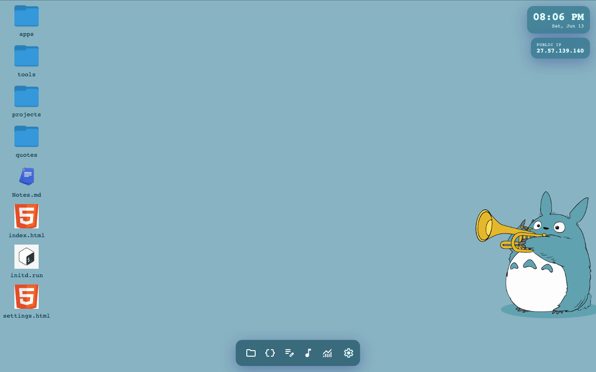
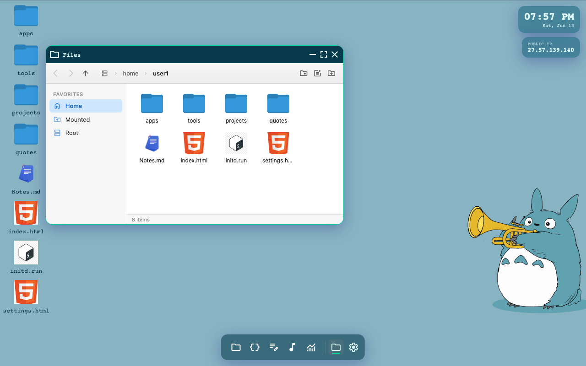
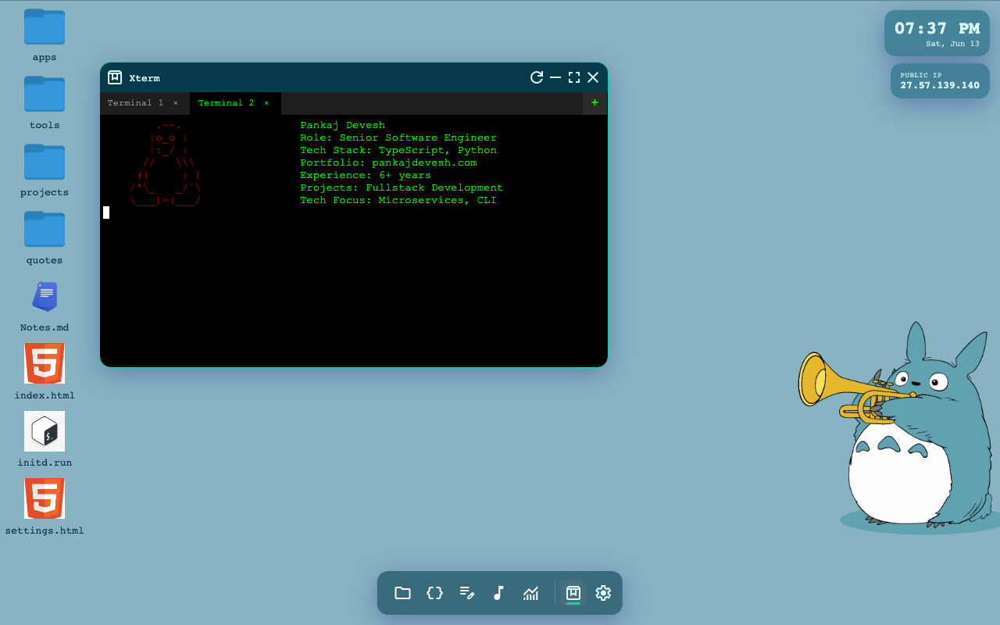
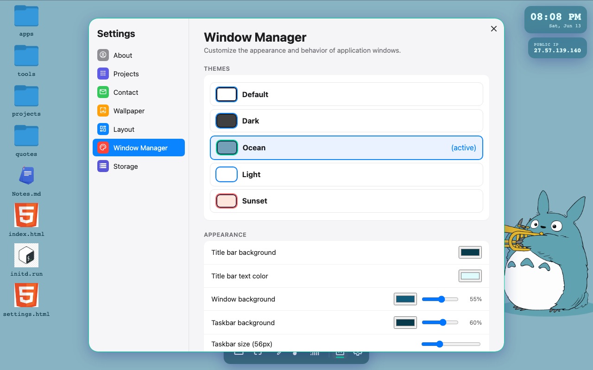
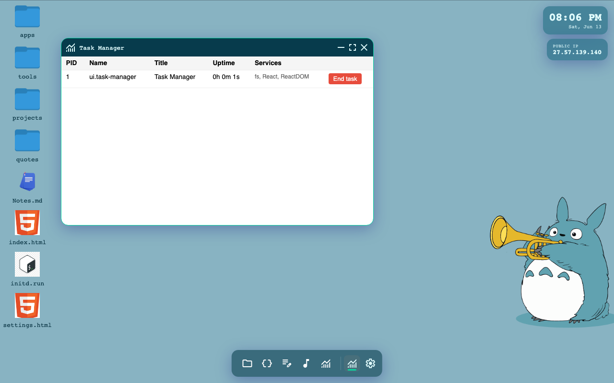
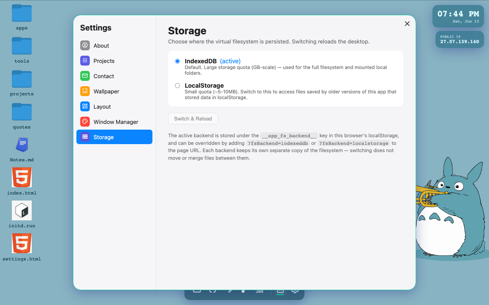

# bootstrapper-js

A browser-based desktop environment ("web OS") built with TypeScript, React and
[BrowserFS](https://github.com/jvilk/BrowserFS). It boots a virtual file system in the
browser, exposes a window manager/desktop shell, and runs a set of bundled mini-apps as
isolated iframes/windows.

[preview](https://deveshpankaj.github.io/bootstrapper-js/)



## Features

- **Virtual filesystem** – BrowserFS-backed `/`, `/tmp` and `/mnt`, persisted in the
  browser. Choose between an **IndexedDB** backend (default, GB-scale) or a
  **LocalStorage** backend (for older saved data) from Settings → Storage.
- **Desktop shell & window manager** – draggable/resizable app windows, a Windows-11
  style taskbar with pinned launchers and live window previews, desktop icons, and a
  right-click context menu.
- **Configurable layouts** – switch the desktop's grid arrangement (header/nav/taskbar
  placement) from Settings → Layout, defined declaratively in `/etc/wm/layouts.json`.
- **Theming** – multiple window manager themes (Default, Dark, Light, Ocean, Sunset)
  plus fine-grained controls for title bar colors, window background, accent color,
  corner radius, blur and shadow.
- **File explorer** – macOS Finder-style UI with a favorites sidebar (Home, Mounted,
  Root), breadcrumb navigation, icon grid, thumbnails, and the ability to mount a local
  folder from your computer.
- **Terminal** – tabbed xterm.js terminal with a small shell (history navigation,
  async commands like `sleep`, `ls`, `echo`, etc.).
- **Task manager** – lists running app processes (PID, title, uptime, services) with
  the ability to end tasks.
- **Settings app** – About, Projects, Contact, Wallpaper, Layout, Window Manager and
  Storage pages.
- **Desktop widgets** – a widgets panel (clock, public IP, etc.) defined in
  `/etc/widgets/`.

## Apps

- **File explorer** – browse, create and delete files/folders in the virtual file system,
  and mount a local folder from your computer (see below).
- **Terminal (xterm.js)** – tabbed terminal with a built-in shell.
- **Notepad** – simple text/code editor (CodeMirror based).
- **VS Code** – embedded VS Code-like editor experience.
- **Markdown viewer** – renders `.md` files.
- **Task Manager** – view and kill running app processes.
- **XML parser** – parse and inspect XML documents.
- **Game of Life** – Conway's Game of Life demo app.
- **Webamp** – embedded Winamp-style media player.
- **WAMP / FS / TOTP / WebRTC tools** – small utility apps under `/home/user1/apps`.

## Development

```sh
pnpm install
pnpm start         # webpack dev server
pnpm start:https   # webpack dev server over HTTPS (needed for some browser APIs)
pnpm build:dev     # build bundles into ./docs
```

## File explorer

The file explorer has a left navigation sidebar with quick shortcuts to **Home**
(`/home/user1`), **Mounted** (`/mnt`) and **Root** (`/`).



### Mounting a local folder

The file explorer can import a folder from your local machine into the virtual file
system using the browser's File System Access API. Click the "mount local folder" icon
(folder-upload icon) in the header and pick a directory — its contents will be copied
recursively into `/mnt/<folder name>` in the virtual file system, and the explorer will
navigate there automatically. This requires a browser that supports
`window.showDirectoryPicker` (e.g. Chrome/Edge) and a secure context (HTTPS or
localhost).

## Terminal

A tabbed terminal app (xterm.js) with a small built-in shell — supports multiple tabs,
command history (up/down arrow), and async commands.



## Window manager themes

Settings → Window Manager lets you pick a preset theme or fine-tune colors, corner
radius, blur and shadow — changes apply live to existing and new windows.



## Task manager

The Task Manager app lists every running window/process with its PID, title, uptime
and registered services, and lets you end tasks.



## Storage backend

Settings → Storage lets you switch the virtual filesystem between an IndexedDB backend
(default, large quota) and a LocalStorage backend (small quota, useful for accessing
data saved by older versions of this app). Switching reloads the desktop.


